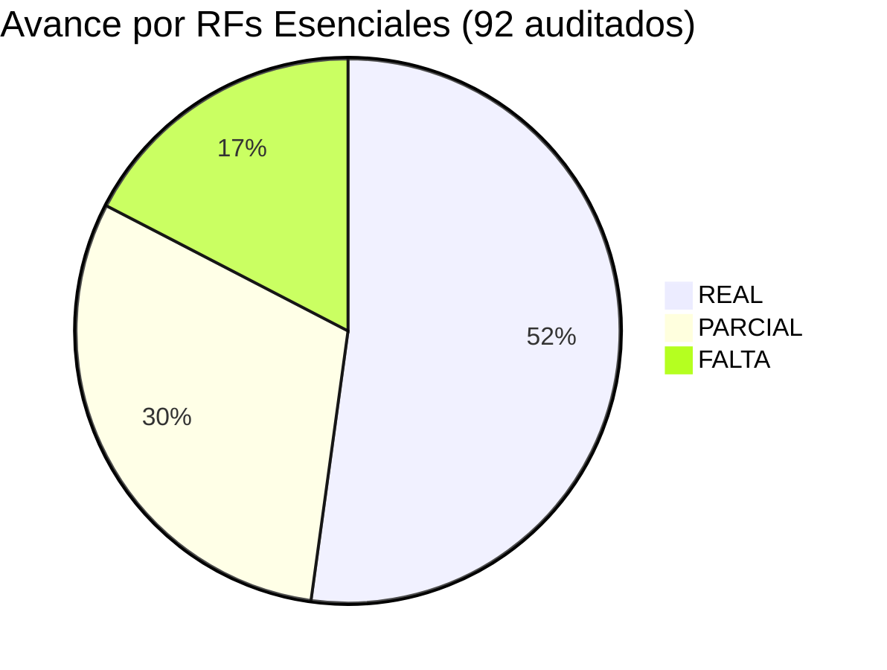
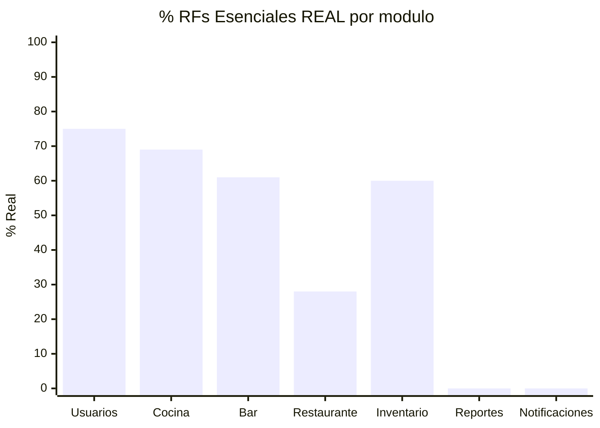
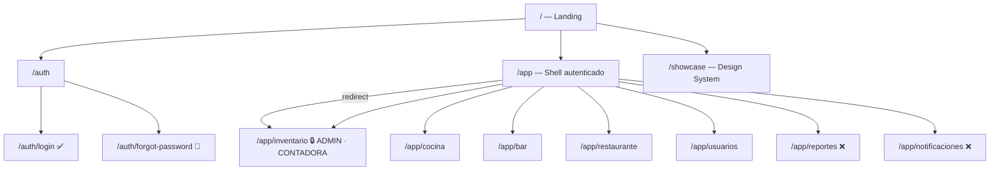
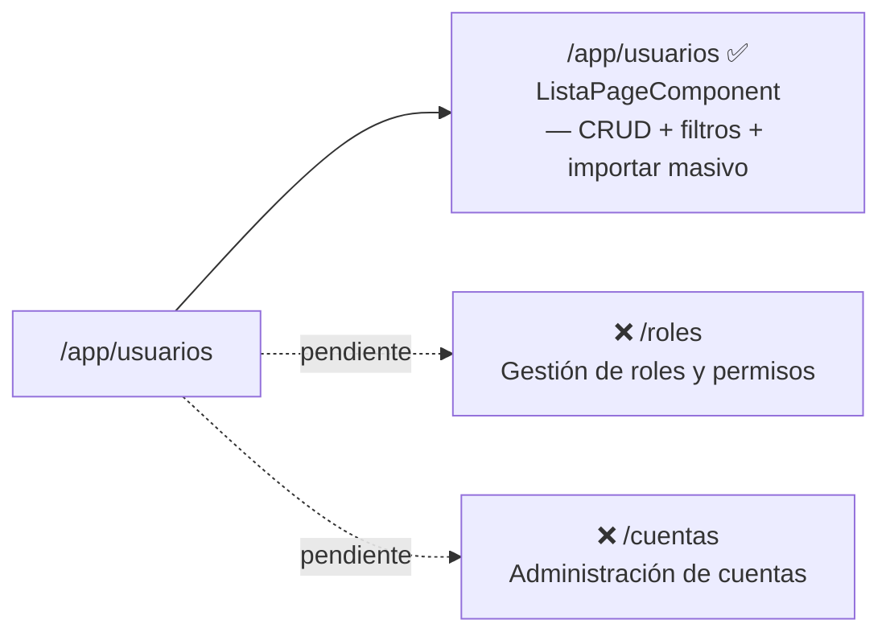
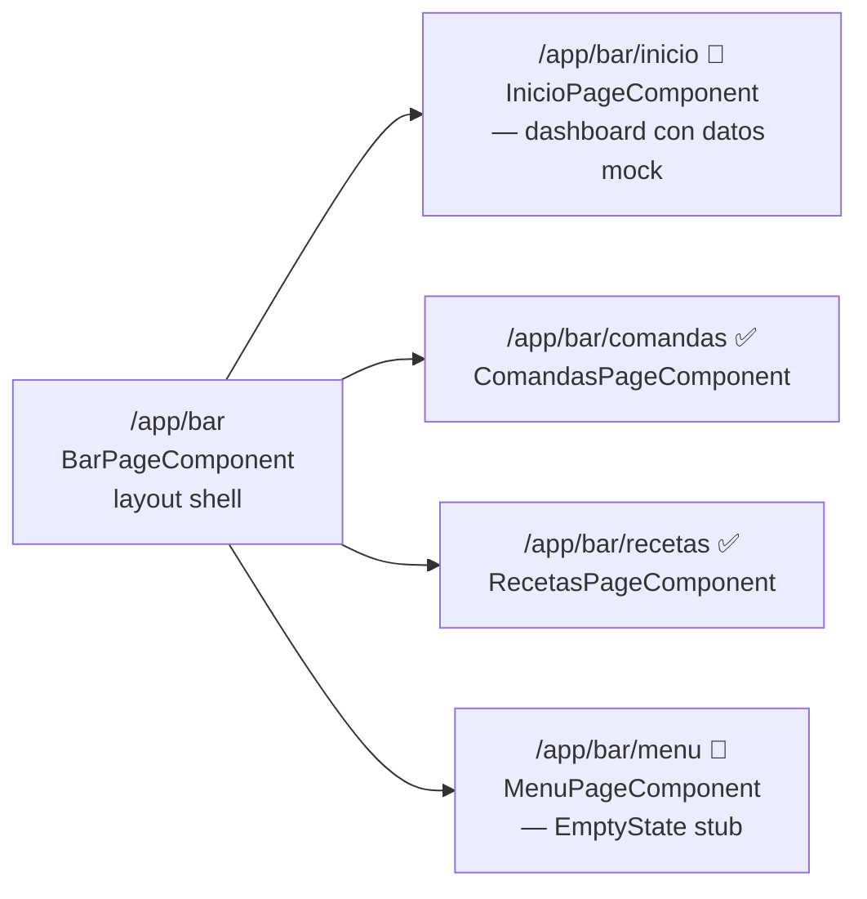

# GastroSENA — Mapa de Navegación

> Última actualización: 2026-05-20 | Rama: `develop` | Auditoría: RFs Esenciales cruzados con código real

## Leyenda

| Ícono | Significado |
|-------|-------------|
| ✅ | RF implementado con lógica real |
| 🔶 | RF parcialmente implementado — estructura sin funcionalidad completa |
| ❌ | RF sin implementar — stub o componente faltante |
| 🔒 | Protegido por `roleGuard` |

---

## Progreso general

> Metodología: auditoría RF por RF — cada Requisito Funcional Esencial de `docs/requisitos.md` fue cruzado con el `.ts` y `.html` del componente responsable.
> Clasificación: **REAL** = RF cumplido (facade + bindings + lógica) | **PARCIAL** = estructura sin funcionalidad completa | **FALTA** = sin implementar

### Por módulo

| Módulo | RFs Esenciales | REAL | PARCIAL | FALTA | % Real |
|--------|---------------|------|---------|-------|--------|
| Auth/Usuarios | RF1.2, RF2.1–2.6.1 | 6 | 1 | 2 | `███████░░░` **75%** |
| Cocina | RF-C 4.0–4.4.1 | 11 | 2 | 5 | `██████░░░░` **69%** |
| Bar | RF-C 4.10–4.19 | 11 | 2 | 5 | `██████░░░░` **61%** |
| Restaurante | RF3.1.x–RF3.5.x | 5 | 11 | 2 | `███░░░░░░░` **28%** |
| Inventario | RF-5.1–5.11 | 21 | 14 | 0 | `██████░░░░` **60%** |
| Reportes | RF6.1.x | 0 | 0 | 13 | `░░░░░░░░░░` **0%** |
| Notificaciones | RF1.8.x | 0 | 0 | 3 | `░░░░░░░░░░` **0%** |
| **TOTAL** | **92** | **48** | **28** | **16** | `█████░░░░░` **52%** |

> **Avance real verificado: 52%** — 48 de 92 RFs Esenciales completamente implementados. 28 RFs adicionales con implementación parcial.

---

## Diagrama general

---

## Módulos en detalle

### `/auth` — Autenticación

| RF | Descripción | Vista | Estado |
|----|-------------|-------|--------|
| RF1.2 | Iniciar sesión | `LoginPageComponent` | ✅ Form reactivo + authService.login() |
| RF1.3 | Restablecer contraseña | `ForgotPasswordPageComponent` | 🔶 Form existe — TODO: conectar endpoint |

---

### `/app/usuarios` — Gestión de Usuarios

| RF | Descripción | Estado | Evidencia |
|----|-------------|--------|-----------|
| RF2.1 | CRUD usuarios | ✅ | facade cargarUsuarios(), crearUsuario(), eliminarUsuario() |
| RF2.2 | Registro individual | ✅ | onGuardarUsuario() + modal UsuarioFormComponent |
| RF2.3/2.3.1 | Registro masivo | ✅ | ImportarUsuariosComponent + facade.importarMasivo() |
| RF2.4 | Consulta y filtros | ✅ | computed usuariosFiltrados + SearchFilterComponent |
| RF2.5 | Gestión de perfiles | ❌ | CuentasPageComponent — stub vacío |
| RF2.6 | Gestión de roles | ❌ | RolesPageComponent — stub vacío |
| RF2.6.1 | Gestión de permisos | ❌ | No implementado |

---

### `/app/cocina` — Cocina

| RF | Descripción | Vista | Estado |
|----|-------------|-------|--------|
| RF-C 4.0 | Visualización de pedidos | InicioPageComponent | ✅ estadisticas + pedidosPendientes signals |
| RF-C 4.0.1 | Mostrar número de pedido | InicioPageComponent | ✅ idComanda en pedidosPendientes |
| RF-C 4.0.2 | Mostrar hora de solicitud | InicioPageComponent | ✅ formatHora() |
| RF-C 4.1 | Gestión del estado | ComandasPageComponent | ✅ cambiarEstado() |
| RF-C 4.1.1 | Cambiar estado de orden | ComandasPageComponent | ✅ Espera → Preparando → Listo → Cancelado |
| RF-C 4.1.2 | Mostrar estado actual | ComandasPageComponent | ✅ computed filtra por estado |
| RF-C 4.2 | Gestión de recetas | RecetasPageComponent | ✅ RecetaService.listar() + CRUD completo |
| RF-C 4.2.1 | Crear recetas | RecetasPageComponent | ✅ GestionRecetaComponent modal |
| RF-C 4.2.2 | Consultar recetas | RecetasPageComponent | ✅ recetasFiltradas computed |
| RF-C 4.2.3 | Actualizar recetas | RecetasPageComponent | ✅ recetaService.actualizarReceta() |
| RF-C 4.2.4 | Eliminar recetas | RecetasPageComponent | ✅ recetaService.eliminarReceta() |
| RF-C 4.3 | Estadísticas de tiempos | InicioPageComponent | 🔶 Datos simulados — sin cálculo real |
| RF-C 4.4 | Alertas a sala | InicioPageComponent | 🔶 Modal incidencias — sin sistema real |
| RF-C 4.3.1 | Registrar inicio preparación | — | ❌ No encontrado |
| RF-C 4.3.2 | Registrar fin preparación | — | ❌ No encontrado |
| RF-C 4.3.3 | Tiempo promedio | — | ❌ No implementado |
| RF-C 4.4.1 | Notificar listo | — | ❌ Sin notificaciones automáticas |

---

### `/app/bar` — Bar

> `BarPageComponent` es un layout shell con `<router-outlet>`. Todas las vistas son hijos de `/app/bar`.

| RF | Descripción | Vista | Estado |
|----|-------------|-------|--------|
| RF-C 4.10 | Visualización pedidos bar | ComandasComponent | ✅ listaComandas + formatIdComanda() |
| RF-C 4.10.1 | Mostrar número de pedido | ComandasComponent | ✅ formatIdComanda(id) → #B*** |
| RF-C 4.10.2 | Mostrar hora solicitud | ComandasComponent | ✅ formatHora(), formatHoraCompleta() |
| RF-C 4.11 | Gestión del estado | ComandasComponent | ✅ comenzarPreparacion(), marcarListo() |
| RF-C 4.11.1 | Cambiar estado | ComandasComponent | ✅ ESPERA → PREPARANDO → TERMINADO |
| RF-C 4.11.2 | Mostrar estado actual | ComandasComponent | ✅ getters comandasEspera/Preparando/Listo |
| RF-C 4.12 | Gestión de recetas bar | RecetasPageComponent | ✅ RecetaService + CRUD completo |
| RF-C 4.12.1 | Crear recetas bar | RecetasPageComponent | ✅ abrirNuevaReceta() + GestionRecetaComponent |
| RF-C 4.12.2 | Consultar recetas bar | RecetasPageComponent | ✅ recetasFiltradas por nombre/categoría |
| RF-C 4.12.3 | Actualizar recetas bar | RecetasPageComponent | ✅ recetaService.actualizarReceta() |
| RF-C 4.12.4 | Eliminar recetas bar | RecetasPageComponent | ✅ confirm dialog + eliminarReceta() |
| RF-C 4.13.1 | Registrar inicio (bar) | — | ❌ No encontrado |
| RF-C 4.13.2 | Registrar fin (bar) | — | ❌ No encontrado |
| RF-C 4.14 | Alertas a sala (bar) | InicioPageComponent | 🔶 Modal incidencias — IncidenciaService inyectado, datos mock |
| RF-C 4.14.1 | Notificar listo (bar) | — | ❌ Sin notificaciones automáticas |
| RF-C 4.18 | Modificaciones (bar) | InicioPageComponent | 🔶 Modal tipo MODIFICACION — mockData vacío |
| RF-C 4.19 | Gestión de menús (bar) | MenuPageComponent | ❌ EmptyState — stub |

---

### `/app/restaurante` — Restaurante

| RF | Descripción | Vista | Estado |
|----|-------------|-------|--------|
| RF3.1.1 | Consultar mapa de mesas | MesasPageComponent | ✅ facade.mesas + computed activas/inactivas |
| RF3.1.1.1 | Asignar mesas | MesasPageComponent | ✅ abrirMesa(id) → facade.abrirMesa() |
| RF3.1.1.2 | Liberar mesas | MesasPageComponent | ✅ liberarMesa(id) → facade.liberarMesa() |
| RF3.1.3 | Agregar mesa | MesasPageComponent | ✅ crearMesa() con número, asientos, zona |
| RF3.1.4 | Eliminar mesa | MesasPageComponent | ✅ eliminarMesa(id) → facade.eliminarMesa() |
| RF3.2.1 | Menú digital | PedidosPageComponent | 🔶 PedidosMenuGridComponent sin lógica real |
| RF3.2.1.1 | Añadir a carrito | PedidosPageComponent | 🔶 Componentes presentes sin binding completo |
| RF3.2.2 | Gestionar carrito | PedidosPageComponent | 🔶 PedidosCartComponent incompleto |
| RF3.2.2.1 | Mostrar valores | PedidosPageComponent | 🔶 Sin cálculo de totales |
| RF3.2.4 | Seguimiento de pedido | PedidosPageComponent | 🔶 Estructura sin status updates |
| RF3.5.1 | Generar factura | CajaPageComponent | 🔶 irANuevaFactura() — modales no integrados |
| RF3.5.3 | Registrar pago | CajaPagarPageComponent | 🔶 confirmarPago() + modal éxito — sin backend |
| RF3.5.3.1 | Pago en efectivo | CajaPagarPageComponent | 🔶 seleccionarMetodo('Efectivo') — UI completa |
| RF3.5.3.2 | Pago con tarjeta | CajaPagarPageComponent | 🔶 seleccionarMetodo('Tarjeta') — UI completa |
| RF3.5.3.3 | Pago por consignación | CajaPagarPageComponent | 🔶 seleccionarMetodo('Transferencia') — UI completa |
| RF3.2.2.2 | Modificar productos carrito | — | ❌ No implementado |
| RF3.2.2.3 | Eliminar productos carrito | — | ❌ No implementado |
| RF3.2.3 | Observaciones por producto | — | ❌ No encontrado |

---

### `/app/inventario` — Inventario 🔒

| RF | Descripción | Vista | Estado |
|----|-------------|-------|--------|
| RF-5.1 | Inventario central | BienesListPageComponent | ✅ facade.bienes + loadAll() |
| RF-5.1.1 | Registro de bienes | BienesListPageComponent | ✅ BienFormComponent + onSaveBien() |
| RF-5.1.2 | Consulta de catálogo | BienesListPageComponent | ✅ onSearch() → setFiltros() |
| RF-5.1.3 | Modificación de bienes | BienesListPageComponent | ✅ onEditar() → actualizarBien() |
| RF-5.1.4 | Eliminación masiva | BienesListPageComponent | ✅ confirmarEliminacion() → eliminarBien() |
| RF-5.1.5 | Detalle de bien | BienesListPageComponent | ✅ onVerDetalle() navega a detalle |
| RF-5.2 | Control de facturación | FacturasListPageComponent | ✅ facade.facturas + CRUD |
| RF-5.2.1 | Registro de factura | FacturasListPageComponent | ✅ FacturaFormComponent + onSaveFactura() |
| RF-5.2.3 | Buscador de facturas | FacturasListPageComponent | ✅ onSearch() con filtro dinámico |
| RF-5.2.4 | Detalle de factura | FacturasListPageComponent | ✅ onVerFactura() navega a detalle |
| RF-5.2.5 | Edición de factura | FacturasListPageComponent | ✅ onEditarFactura() |
| RF-5.2.6 | Anulación de factura | FacturasListPageComponent | ✅ onAnularFactura() + modal confirmación |
| RF-5.3 | Gestión GIL | SolicitudesListComponent | ✅ facade.solicitudes + loadAll() |
| RF-5.3.6 | Historial GIL | SolicitudesListComponent | ✅ lista filtrable por estado/fecha |
| RF-5.4 | Consolidado de Ejecución | ConsolidadoListComponent | ✅ facade.consolidados + reversarConsolidado() |
| RF-5.4.2 | Generación de tabla | ConsolidadoListComponent | ✅ DataTableComponent con datos facade |
| RF-5.5 | Entradas y Salidas | MovimientosListComponent | ✅ facade.movimientos + loadAll() |
| RF-5.6 | Alertas de Stock | AlertasListComponent | ✅ facade.alertas + computed kpiCriticas |
| RF-5.7 | Presupuesto General | PresupuestoDashboardComponent | ✅ facade.resumen + programas + afectaciones |
| RF-5.7.2 | Visibilidad financiera | PresupuestoDashboardComponent | ✅ Saldos: Disponible, Comprometido, Pagado |
| RF-5.7.3 | Afectación presupuestal | PresupuestoDashboardComponent | ✅ facade.afectaciones (pago, traslado, etc) |
| RF-5.8 | Conciliación de Inventario | ConciliacionDashboardComponent | ✅ facade.conciliaciones + loadAll() |
| RF-5.10 | Actas de Legalización | ActasListComponent | ✅ facade.actas + filtrado por estado/ficha |
| RF-5.10.10 | Estados de acta | ActasListComponent | ✅ borrador → pendiente → firmada → archivada |
| RF-5.11 | Paquete Probatorio | PaqueteListComponent | ✅ facade.paquetes + KPIs |
| RF-5.11.1 | Estructura del paquete | PaqueteListComponent | ✅ expediente, responsable, documentos |
| RF-5.2.2 | Asociación Factura-GIL | FacturasListPageComponent | 🔶 Estructura sin validaciones CUFE |
| RF-5.3.1 | Registro de solicitud GIL | SolicitudesListComponent | 🔶 Sin todos los campos dinámicos |
| RF-5.3.2 | Emisión GIL | SolicitudesListComponent | 🔶 Estados parciales — sin flujo completo |
| RF-5.4.1 | Selección de fuente GIL | ConsolidadoListComponent | 🔶 Lista pero sin selección UI |
| RF-5.5.1 | Registro de entrada | MovimientosListComponent | 🔶 Componente entrada existe — stub |
| RF-5.5.3 | Registro de salida | MovimientosListComponent | 🔶 Componente salida existe — stub |
| RF-5.6.1 | Configurar umbrales | AlertasListComponent | 🔶 irAConfig() navega — sin UI implementada |
| RF-5.6.2 | Notificación en tiempo real | AlertasListComponent | 🔶 KPIs visibles — sin websocket |
| RF-5.7.1 | Asignación inicial presupuesto | PresupuestoDashboardComponent | 🔶 Solo visualización — sin UI para editar |
| RF-5.8.1 | Toma física | ConciliacionDashboardComponent | 🔶 Componente toma-fisica existe — stub |
| RF-5.8.4 | Detección de brechas | ConciliacionDashboardComponent | 🔶 Datos mock — sin cálculos reales |
| RF-5.9 | Requisiciones Diarias | RequisicionesDashboardComponent | 🔶 facade.requisiciones — ciclo incompleto |
| RF-5.9.1 | Apertura de requisición | RequisicionesDashboardComponent | 🔶 Componente create existe — stub |
| RF-5.10.1 | Apertura de acta | ActasListComponent | 🔶 Componente create existe — stub |
| RF-5.10.7 | Firmantes de ley | ActasListComponent | 🔶 Modelo incluye instructor — sin flujo de firmas |
| RF-5.11.3 | Candado de completitud | PaqueteListComponent | 🔶 Modelo incluye documentos — sin validación |
| RF-5.11.7 | Integridad de datos | PaqueteListComponent | 🔶 Referencias vinculadas — sin trazabilidad visual |

---

### Módulos pendientes

| Módulo | Ruta | RFs Esenciales | Estado |
|--------|------|---------------|--------|
| Reportes | `/app/reportes` | RF6.1–RF6.1.12 (13 RFs) | ❌ Solo landing — sin ningún RF implementado |
| Notificaciones | `/app/notificaciones` | RF1.8.1–1.8.3 (3 RFs) | ❌ Solo landing — sin ningún RF implementado |

---

## Guards activos

| Guard | Aplicado en | Roles permitidos |
|-------|------------|-----------------|
| `authGuard` | `/app` (desactivado — ver `shell.routes.ts`) | Todos los autenticados |
| `roleGuard` | `/app/inventario` | `ADMINISTRADOR`, `CONTADORA` |
| `roleGuard` | `/app/cocina` (desactivado temporalmente) | `CHEF`, `ADMIN_COCINA`, `AUXILIAR_COCINA` |
| `roleGuard` | `/app/bar` (desactivado temporalmente) | `LIDER_BAR`, `ADMIN_BAR`, `BARTENDER` |

> ⚠️ Los guards de `authGuard` y los de cocina/bar están comentados con `TODO`. Activarlos antes de producción.
