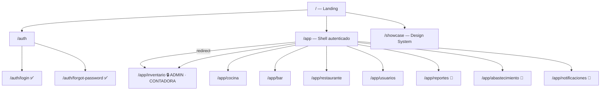
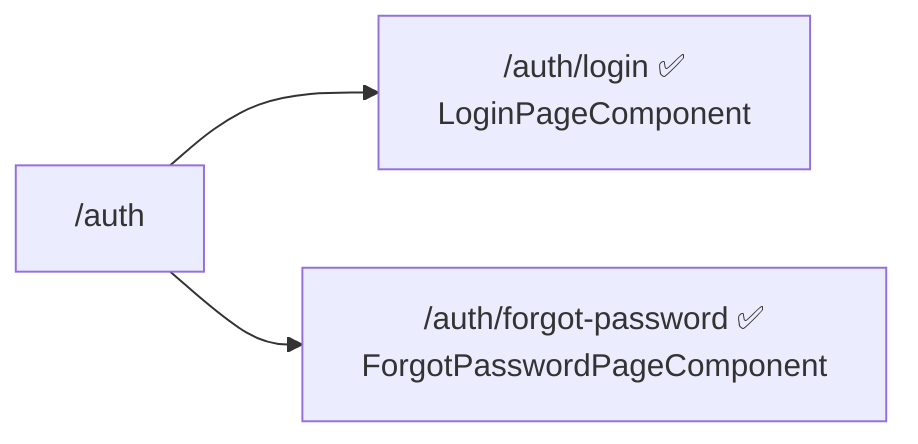
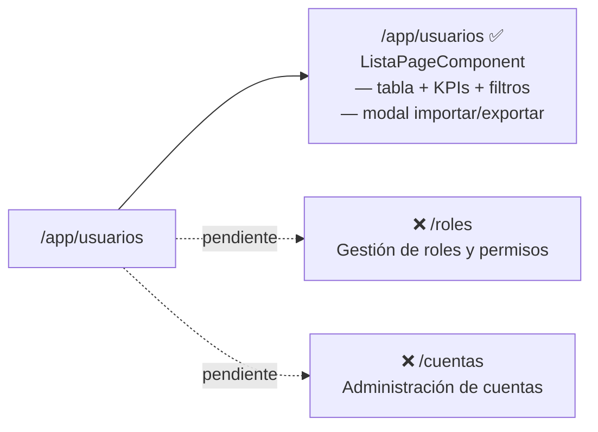
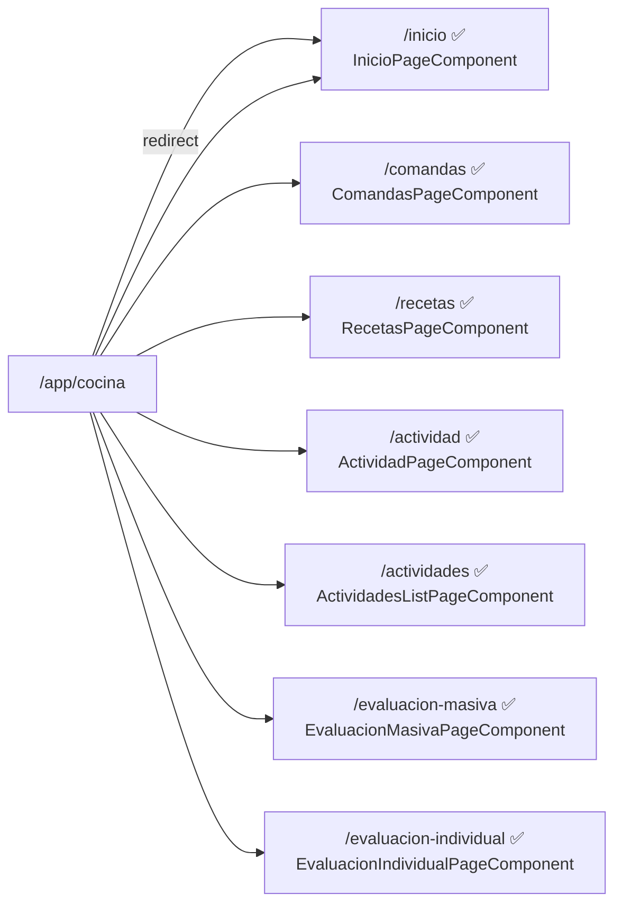
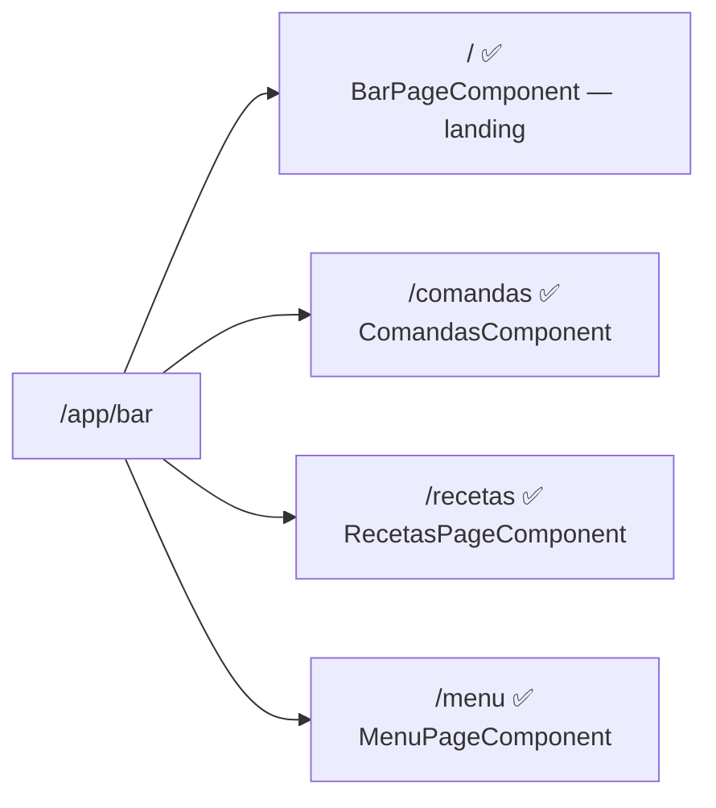
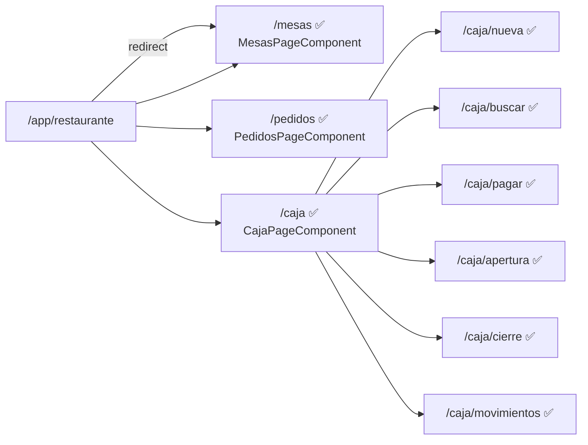

# GastroSENA — Mapa de Navegación

> Última actualización: 2026-05-20 | Rama: `develop`

## Leyenda

| Ícono | Significado |
|-------|-------------|
| ✅ | Implementado con lógica real |
| 🔶 | Stub — componente existe pero sin contenido |
| ❌ | Pendiente — ruta o componente no creado aún |
| 🔒 | Protegido por `roleGuard` |

---

## Diagrama general

---

## Módulos en detalle

### `/auth` — Autenticación

---

### `/app/usuarios` — Gestión de Usuarios

| Ruta | Componente | Estado |
|------|-----------|--------|
| `/app/usuarios` | `ListaPageComponent` | ✅ Lista con filtros, KPIs, importar/exportar |
| `/app/usuarios/roles` | `RolesPageComponent` | ❌ Stub sin rutas registradas |
| `/app/usuarios/cuentas` | `CuentasPageComponent` | ❌ Stub sin rutas registradas |

---

### `/app/cocina` — Cocina

| Ruta | Estado |
|------|--------|
| `/app/cocina/inicio` | ✅ |
| `/app/cocina/comandas` | ✅ |
| `/app/cocina/recetas` | ✅ |
| `/app/cocina/actividad` | ✅ |
| `/app/cocina/actividades` | ✅ |
| `/app/cocina/evaluacion-masiva` | ✅ |
| `/app/cocina/evaluacion-individual` | ✅ |

---

### `/app/bar` — Bar

| Ruta | Estado |
|------|--------|
| `/app/bar` | ✅ Landing |
| `/app/bar/comandas` | ✅ |
| `/app/bar/recetas` | ✅ |
| `/app/bar/menu` | ✅ |

---

### `/app/restaurante` — Restaurante

| Ruta | Estado |
|------|--------|
| `/app/restaurante/mesas` | ✅ |
| `/app/restaurante/pedidos` | ✅ |
| `/app/restaurante/caja` | ✅ Dashboard de caja |
| `/app/restaurante/caja/nueva` | ✅ |
| `/app/restaurante/caja/buscar` | ✅ |
| `/app/restaurante/caja/pagar` | ✅ |
| `/app/restaurante/caja/apertura` | ✅ |
| `/app/restaurante/caja/cierre` | ✅ |
| `/app/restaurante/caja/movimientos` | ✅ |

---

### `/app/inventario` — Inventario 🔒

```mermaid
flowchart TD
    INV["/app/inventario"] -->|redirect| BIENES

    INV --> BIENES["/bienes ✅"]
    BIENES --> B_EXP["/bienes/exportar ✅"]
    BIENES --> B_ID["/bienes/:id ✅"]

    INV --> SOL["/solicitudes-gil ✅"]
    SOL --> SOL_NEW["/solicitudes-gil/nueva ✅"]
    SOL --> SOL_ID["/solicitudes-gil/:id ✅"]
    SOL_ID --> SOL_EDIT["/editar ✅"]
    SOL_ID --> SOL_EXP["/exportar ✅"]

    INV --> FACT["/facturas ✅"]
    FACT --> FACT_IMP["/facturas/importar ✅"]
    FACT --> FACT_GIL["/facturas/gil/:id ✅"]
    FACT --> FACT_ID["/facturas/:id ✅"]
    FACT_ID --> FACT_EDIT["/editar ✅"]

    INV --> CONS["/consolidado ✅"]
    CONS --> CONS_NEW["/consolidado/nuevo ✅"]
    CONS --> CONS_ID["/consolidado/:id ✅"]

    INV --> CONC["/conciliacion ✅"]
    CONC --> CONC_TF["/toma-fisica ✅"]
    CONC --> CONC_HIST["/historial ✅"]
    CONC --> CONC_ID["/conciliacion/:id ✅"]

    INV --> MOV["/movimientos ✅"]
    MOV --> MOV_ENT["/entrada ✅"]
    MOV --> MOV_GIL["/entrada-gil ✅"]
    MOV --> MOV_SAL["/salida ✅"]
    MOV --> MOV_EXP["/exportar ✅"]
    INV --> MOV_ID["/movimientos/:id ✅"]

    INV --> ALERT["/alertas ✅"]
    ALERT --> ALERT_HIST["/historial ✅"]
    ALERT --> ALERT_CFG["/configuracion ✅"]
    ALERT --> ALERT_ID["/alertas/:id ✅"]
    ALERT_ID --> ALERT_RES["/resolver ✅"]

    INV --> PRES["/presupuesto ✅"]
    PRES --> PRES_REG["/registrar ✅"]
    PRES --> PRES_TRA["/traslado ✅"]
    PRES --> PRES_EXP["/exportar ✅"]
    PRES --> PRES_GIL["/cargar-gil ✅"]

    INV --> ACTAS["/actas ✅"]
    ACTAS --> ACTAS_NEW["/nueva ✅"]
    ACTAS --> ACTAS_ID["/actas/:id ✅"]
    ACTAS_ID --> ACTAS_FIR["/cargar-firma ✅"]

    INV --> PAQ["/paquete-probatorio ✅"]
    PAQ --> PAQ_NEW["/nuevo ✅"]
    PAQ --> PAQ_ID["/paquete-probatorio/:id ✅"]
    PAQ_ID --> PAQ_ADJ["/adjuntar ✅"]
    PAQ_ID --> PAQ_REQ["/requisicion ✅"]

    INV --> REQ["/requisiciones ✅"]
    REQ --> REQ_DASH["/requisiciones dashboard ✅"]
    REQ_DASH --> REQ_DET["/detalle/:id ✅"]
    REQ_DASH --> REQ_DES["/despacho/:id ✅"]
    REQ --> REQ_NEW["/nueva ✅"]
    REQ --> REQ_FIR["/firmar/:id ✅"]
    REQ --> REQ_RES["/resumen/:id ✅"]
```

---

### Módulos stub

Estos módulos están registrados en el router pero sin páginas internas aún.

| Módulo | Ruta | Estado |
|--------|------|--------|
| Reportes | `/app/reportes` | 🔶 Solo landing (`ReportesPageComponent`) |
| Abastecimiento | `/app/abastecimiento` | 🔶 Solo landing (`AbastecimientoPageComponent`) |
| Notificaciones | `/app/notificaciones` | 🔶 Solo landing (`NotificacionesPageComponent`) |

---

## Resumen por módulo

| Módulo | Rutas implementadas | Rutas pendientes | Estado general |
|--------|-------------------|-----------------|----------------|
| Auth | 2 | 0 | ✅ Completo |
| Usuarios | 1 | 2 (roles, cuentas) | 🔶 Parcial |
| Cocina | 7 | 0 | ✅ Completo |
| Bar | 4 | 0 | ✅ Completo |
| Restaurante | 9 | 0 | ✅ Completo |
| Inventario | 35 | 0 | ✅ Completo |
| Reportes | 0 | — | 🔶 Stub |
| Abastecimiento | 0 | — | 🔶 Stub |
| Notificaciones | 0 | — | 🔶 Stub |

**Total rutas activas: 58 de ~63 planeadas**

---

## Guards activos

| Guard | Aplicado en | Roles permitidos |
|-------|------------|-----------------|
| `authGuard` | `/app` (desactivado temporalmente — ver `shell.routes.ts`) | Todos los autenticados |
| `roleGuard` | `/app/inventario` | `ADMINISTRADOR`, `CONTADORA` |
| `roleGuard` | `/app/cocina` (desactivado temporalmente) | `CHEF`, `ADMIN_COCINA`, `AUXILIAR_COCINA` |
| `roleGuard` | `/app/bar` (desactivado temporalmente) | `LIDER_BAR`, `ADMIN_BAR`, `BARTENDER` |

> ⚠️ Los guards de `authGuard` y los de cocina/bar están comentados con `TODO`. Activarlos antes de producción.
