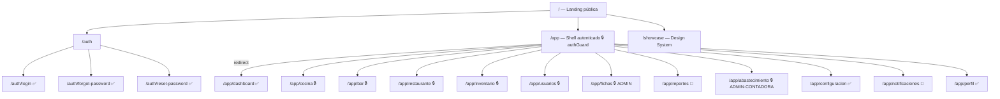
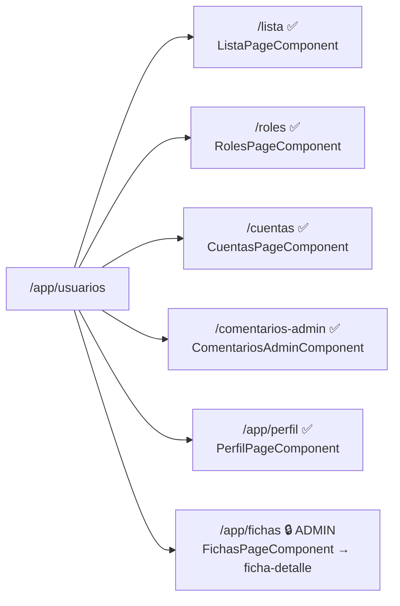
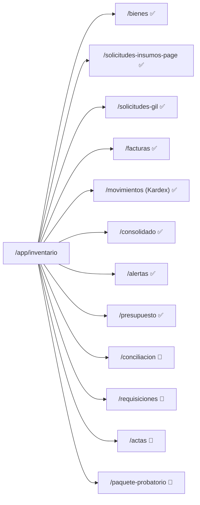

# GastroSENA — Mapa de Navegación

> Última actualización: 2026-06-09 | Rama: `feat/inventario/playwright-e2e` | Auditoría: rutas reales + capa `data-access` cruzadas con código

## Leyenda

| Ícono | Significado |
|-------|-------------|
| ✅ | Implementado con lógica real (componente + facade/servicio HTTP cableado) |
| 🔶 | Parcialmente implementado — estructura presente, lógica o backend incompletos |
| ❌ | Sin implementar — stub o componente faltante |
| 🔒 | Protegido por `permissionGuard` / `roleGuard` |

---

## Cambios clave desde la auditoría anterior (2026-05-20)

- **Inventario migró de facade NgRx con mocks a una capa `data-access` HTTP real**: 13 dominios, cada uno con su `*.facade.ts` (signals) + `*.service.ts` (HttpClient) + `api/*.api.ts` (DTOs alineados a Swagger) + `mappers/*.mapper.ts`. **15 servicios usan `HttpClient`**.
- **Guards**: el mecanismo principal pasó a `permissionGuard([...])` por permisos granulares. `roleGuard` queda para `/app/fichas` y `/app/abastecimiento`. `authGuard` ya está **activo** en `/app`.
- **i18n**: navegación con `tKey` (claves de traducción) en todo el sidebar.
- **Módulos nuevos**: `configuracion` (tema + idioma) y `abastecimiento` (ruta protegida ADMIN/CONTADORA).
- **Auth**: se sumó `reset-password` (flujo de restablecimiento completo).
- **Dashboard**: `/app` redirige a `/app/dashboard` (no a inventario).
- **Reportes** y **Notificaciones** dejaron de ser 0% — ya tienen facade/servicio con `HttpClient`.

> ⚠️ Alcance de esta auditoría: se verificó **rutas reales + capa de datos cableada a HTTP + existencia y tamaño de componentes**. La profundidad de cada RF a nivel UI no se re-auditó RF por RF; los estados reflejan evidencia estructural.

---

## Diagrama general



---

## Módulos en detalle

### `/auth` — Autenticación

| RF | Descripción | Vista | Estado |
|----|-------------|-------|--------|
| RF1.2 | Iniciar sesión | `LoginPageComponent` | ✅ Form reactivo + authService.login() |
| RF1.3 | Restablecer contraseña | `ForgotPasswordPageComponent` | ✅ Solicitud de restablecimiento |
| RF1.3.1 | Confirmar nueva contraseña | `ResetPasswordPageComponent` | ✅ Vista de reset con token |

---

### `/app/usuarios` — Gestión de Usuarios



| RF | Descripción | Estado | Evidencia |
|----|-------------|--------|-----------|
| RF2.1 | CRUD usuarios | ✅ | `ListaPageComponent` + facade |
| RF2.2 | Registro individual | ✅ | `UsuarioFormComponent` (modal) |
| RF2.3/2.3.1 | Registro masivo | ✅ | `ImportarUsuariosComponent` |
| RF2.3.2 | Exportar usuarios | ✅ | `ExportarUsuariosComponent` |
| RF2.4 | Consulta y filtros | ✅ | usuariosFiltrados + SearchFilter |
| RF2.5 | Gestión de cuentas/perfiles | ✅ | `CuentasPageComponent` + `PerfilPageComponent` |
| RF2.6 | Gestión de roles | ✅ | `RolesPageComponent` (182 líneas) |
| RF2.6.1 | Gestión de permisos | 🔶 | Permisos consumidos por `permissionGuard`; UI de edición parcial |
| RF2.7 | Gestión de fichas | ✅ | `FichasPageComponent` + `FichaDetalleComponent` (solo ADMIN) |
| RF2.8 | Historial / comentarios admin | ✅ | `HistorialPageComponent` + `ComentariosAdminComponent` |

---

### `/app/cocina` — Cocina 🔒

> `permissionGuard(['RECETAS_GESTIONAR','RECETAS_CONSULTAR','COMANDAS_CONSULTAR','PEDIDOS_ACTIVOS_VISUALIZAR'])`
> Sidebar: Inicio · Comandas · Recetas · **Evaluar** (nuevo)

| RF | Descripción | Vista | Estado |
|----|-------------|-------|--------|
| RF-C 4.0 | Visualización de pedidos | `InicioPageComponent` | ✅ estadísticas + pedidosPendientes |
| RF-C 4.1 | Gestión del estado de comanda | `ComandasPageComponent` | ✅ cambiarEstado() + `ComandaCardComponent` |
| RF-C 4.2 | Gestión de recetas | `RecetasPageComponent` | ✅ CRUD completo + `GestionRecetaComponent` |
| RF-C 4.2.5 | Gestión de categorías | `GestionCategoriasComponent` | ✅ nuevo |
| RF-C 4.3 | Estadísticas de tiempos | `InicioPageComponent` | 🔶 datos parciales |
| RF-C 4.4 | Alertas a sala | `InicioPageComponent` | 🔶 modal incidencias |
| RF-C 4.5 | Actividades de formación | `ActividadesListPageComponent` / `ActividadPageComponent` | ✅ nuevo |
| RF-C 4.6 | Evaluación individual | `EvaluacionIndividualPageComponent` | ✅ nuevo (184 líneas) |
| RF-C 4.6.1 | Evaluación masiva | `EvaluacionMasivaPageComponent` | ✅ nuevo (253 líneas) |

---

### `/app/bar` — Bar 🔒

> `permissionGuard(['COMANDAS_CONSULTAR','RECETAS_CONSULTAR','PEDIDOS_ACTIVOS_VISUALIZAR'])`
> Sidebar: Inicio · Comandas · Recetas · **Estadísticas** (nuevo)

| RF | Descripción | Vista | Estado |
|----|-------------|-------|--------|
| RF-C 4.10 | Visualización pedidos bar | `ComandasPageComponent` | ✅ + `ComandaCardComponent` |
| RF-C 4.11 | Gestión del estado | `ComandasPageComponent` | ✅ ESPERA → PREPARANDO → TERMINADO |
| RF-C 4.12 | Gestión de recetas bar | `RecetasPageComponent` | ✅ CRUD + `GestionRecetaComponent` |
| RF-C 4.12.5 | Gestión de categorías | `GestionCategoriasComponent` | ✅ nuevo |
| RF-C 4.14 | Alertas a sala (bar) | `InicioPageComponent` | 🔶 modal incidencias |
| RF-C 4.15 | Estadísticas de bar | `EstadisticasPageComponent` | ✅ nuevo (170 líneas) |
| RF-C 4.19 | Gestión de menús (bar) | `MenuPageComponent` | ❌ stub (18 líneas) |

---

### `/app/restaurante` — Restaurante 🔒

> `permissionGuard(['MODULO_MESAS_VER','MESAS_CONSULTAR','COMANDAS_CREAR','PEDIDOS_ACTIVOS_VISUALIZAR','FACTURAS_GENERAR'])`
> Sidebar: Mesas · Pedidos · Caja

| RF | Descripción | Vista | Estado |
|----|-------------|-------|--------|
| RF3.1.1 | Mapa de mesas | `MesasPageComponent` (520 líneas) | ✅ abrir/liberar/crear/eliminar mesa |
| RF3.2.x | Menú digital y carrito | `PedidosMenuGridComponent` / `PedidosCartComponent` | 🔶 estructura sin flujo completo de pedido |
| RF3.5.1 | Generar factura / nueva caja | `CajaPageComponent` / `CajaNuevaPageComponent` | 🔶 UI completa, backend parcial |
| RF3.5.2 | Buscar facturas en caja | `CajaBuscarPageComponent` (203 líneas) | ✅ buscador con filtros |
| RF3.5.3 | Registrar pago | `CajaPagarPageComponent` (211 líneas) | 🔶 efectivo/tarjeta/transferencia — sin backend confirmado |
| RF3.5.4 | Cierre de caja | `CajaCierrePageComponent` | 🔶 |
| RF3.5.5 | Movimientos de caja | `CajaMovimientosPageComponent` | 🔶 |
| RF3.6.1 | Historial estudiante | `HistorialEstudiantePageComponent` | ✅ |
| RF3.6.2 | Historial instructor | `HistorialInstructorPageComponent` | ✅ |

---

### `/app/inventario` — Inventario 🔒

> `permissionGuard(['bienes:ver','facturas:ver','consolidado:ver','alertas:ver','FACTURAS_GENERAR'])`
> **Capa de datos refactorizada**: cada dominio expone `*.facade.ts` (signals) → `*.service.ts` (HttpClient) → `api/*.api.ts` (DTOs Swagger) → `mappers/*.mapper.ts`.



| Dominio / RF | Rutas | Componentes | Estado |
|--------------|-------|-------------|--------|
| **Bienes** (RF-5.1.x) | `/bienes`, `/bienes/exportar`, `/bienes/:id` | `BienesListPageComponent`, `BienExportPageComponent`, `BienDetailPageComponent`, modales form/import/delete, contrato-import | ✅ `BienesService` HTTP (`/catalog/productos`) — CRUD, KPIs, import Excel, export async, masivo |
| **Solicitudes GIL F-014** (RF-5.3.x) | `/solicitudes-gil` (list, generar, :id, editar, exportar) | `SolicitudesListComponent` + generar/detail/edit/export | ✅ `SolicitudesFacade` + `SolicitudesService` (sourcing/procurement HTTP) |
| **Solicitudes de Insumos** (bandeja aprobación) | `/solicitudes-insumos-page` (list, nueva, :id, editar) | `SolicitudesInsumosListComponent` + form/detail/consolidacion | ✅ aprobar/rechazar sesión + consolidación |
| **Facturas Electrónicas** (RF-5.2.x) | `/facturas` (import, gil/:id, :id, :id/editar) | `FacturasListPageComponent` + import/detail/edit + gil-detail | ✅ `FacturasFacade` + `FacturasService` HTTP |
| **Consolidado de Ejecución** (RF-5.4.x) | `/consolidado` (nuevo, :id) | `ConsolidadoListComponent` + create/detail + modales reversar/exportar | ✅ `ConsolidadoFacade` + service |
| **Kardex / Movimientos** (RF-5.5.x) | `/movimientos` (ajuste, exportar, :id) | `MovimientosListComponent` + ajuste/export/detail | ✅ `KardexFacade` + `MovimientosService` (entradas/salidas/ajustes) |
| **Alertas de Stock** (RF-5.6.x) | `/alertas` (historial, configuracion, :id/resolver) | `AlertasListComponent` + historial/config/detail/resolver | ✅ `AlertasFacade` + service — incluye config de umbrales y resolución |
| **Presupuesto General** (RF-5.7.x) | `/presupuesto` (registrar, traslado, exportar, cargar-gil) | `PresupuestoDashboardComponent` + registrar/traslado/exportar/cargar-gil | ✅ `PresupuestoFacade` + service (budget HTTP) |
| **Conciliación** (RF-5.8.x) | `/conciliacion` (toma-fisica, historial, :id) | `ConciliacionDashboardComponent` + toma-fisica/historial/detalle | 🔶 `ConciliacionFacade` + service; detección de brechas/cálculos pendientes de backend |
| **Requisiciones (Formato 45-S)** (RF-5.9.x) | `/requisiciones` (nueva, firmar/:id, resumen, detalle/:id, despacho/:id) | `RequisicionesDashboardComponent` + create/firmar/resumen/detalle/despacho | 🔶 `RequisicionesFacade` + service; ciclo de firma/despacho parcial |
| **Actas de Legalización** (RF-5.10.x) | `/actas` (nueva, :id, :id/imprimir, cargar-firma) | `ActasListComponent` + create/detail/print/upload | 🔶 `ActasFacade` + service; flujo de firmas pendiente de contratos backend |
| **Paquete Probatorio** (RF-5.11.x) | `/paquete-probatorio` (nuevo, :id, adjuntar, requisicion) | `PaqueteListComponent` + create/detail/upload/req-detail | 🔶 `PaqueteFacade` + service; validación de completitud/trazabilidad parcial |

> Servicios con `.spec.ts` (tests unitarios): `contratos`, `facturas`, `paquete`. Mappers con spec: `inventory`, `sourcing`. Rama actual añade E2E Playwright (umbrales, bienes editar/activar/desactivar).
>
> 🔶 en conciliación/requisiciones/actas/paquete = la UI y la capa HTTP existen, pero algunos flujos esperan **contratos de backend confirmados** (ver FASE BACKEND en `CLAUDE.md`).

---

### `/app/reportes` — Reportes 🔶

> `permissionGuard(['MODULO_REPORTES_VER','REPORTES_GESTIONAR','REPORTES_PEDIDOS_COCINA','REPORTES_VENTAS_MESERO'])`
> Sidebar: Ventas · Inventario · Estadísticas cocina

| RF | Descripción | Vista | Estado |
|----|-------------|-------|--------|
| RF6.1 | Panel de reportes | `ReportesPageComponent` + `ReportesFacade` (HttpClient) | 🔶 facade y página presentes |
| RF6.1.x | Estadísticas de cocina | `EstadisticasPageComponent` | 🔶 implementación inicial |
| RF6.1.x | Reportes de ventas / inventario | rutas `/reportes/ventas`, `/reportes/inventario` | 🔶 navegación definida, vistas en construcción |

---

### `/app/notificaciones` — Notificaciones 🔶

| RF | Descripción | Vista | Estado |
|----|-------------|-------|--------|
| RF1.8.x | Centro de notificaciones | `NotificacionesPageComponent` + `NotificacionesService` (HttpClient) | 🔶 página y servicio presentes — sin tiempo real (websocket) |

---

### `/app/configuracion` — Configuración ✅ (módulo nuevo)

| Función | Vista | Estado |
|---------|-------|--------|
| Ajustes generales | `ConfigPageComponent` + `ConfiguracionFacade`/`ConfiguracionService` | ✅ |
| Tema (claro/oscuro) | `ThemeSettingsService` | ✅ |
| Idioma (i18n) | `I18nService` + `translations.ts` | ✅ |
| Eliminación de bien | `BienDeletePageComponent` | ✅ |

---

### `/app/abastecimiento` — Abastecimiento 🔒 (módulo nuevo)

> `roleGuard([ADMINISTRADOR, CONTADORA])` — ruta registrada en el shell; ver `libs/abastecimiento`.

---

## Guards activos

| Guard | Aplicado en | Criterio |
|-------|------------|----------|
| `authGuard` | `/app` (raíz del shell) | **Activo** — requiere sesión autenticada |
| `permissionGuard([...])` | cocina, bar, restaurante, inventario, usuarios, reportes | Permisos granulares por módulo |
| `roleGuard([ADMINISTRADOR])` | `/app/fichas` | Solo administrador |
| `roleGuard([ADMINISTRADOR, CONTADORA])` | `/app/abastecimiento` | Admin y contadora |

> El mecanismo principal de autorización es ahora `permissionGuard` por permisos (no por rol). `roleGuard` se reserva para fichas y abastecimiento.

---

## Capa de datos de inventario (referencia rápida)

```
libs/inventario/inventario/src/lib/data-access/
├── *.facade.ts        ← 13 facades (signals): bienes(inventario), solicitudes, giles,
│                         facturas, contratos, consolidado, kardex, alertas,
│                         presupuesto, conciliacion, requisiciones, actas, paquete, reporting
├── services/          ← 15 servicios con HttpClient (+ specs: contratos, facturas, paquete)
├── api/               ← DTOs Swagger: catalog, inventory, procurement, sourcing, budget,
│                         alerts, reconciliation, legalization, reporting, training
└── mappers/           ← DTO ↔ modelo de dominio (+ specs: inventory, sourcing)
```
